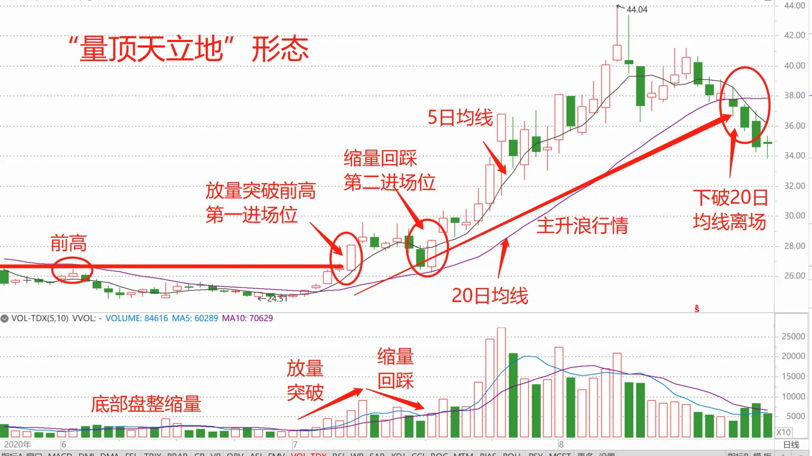
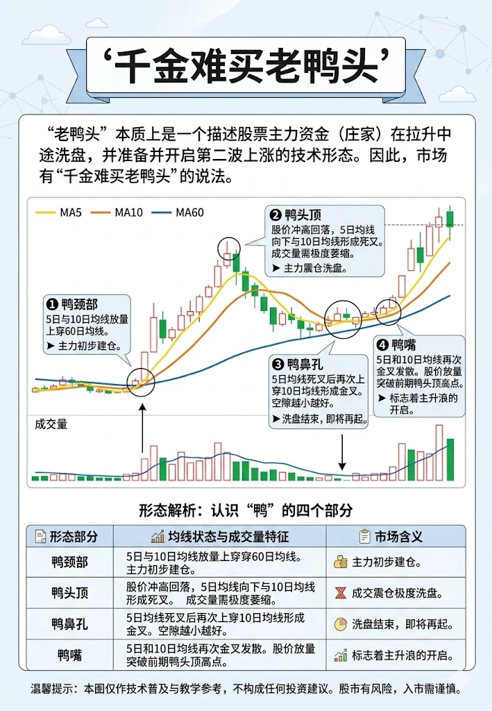
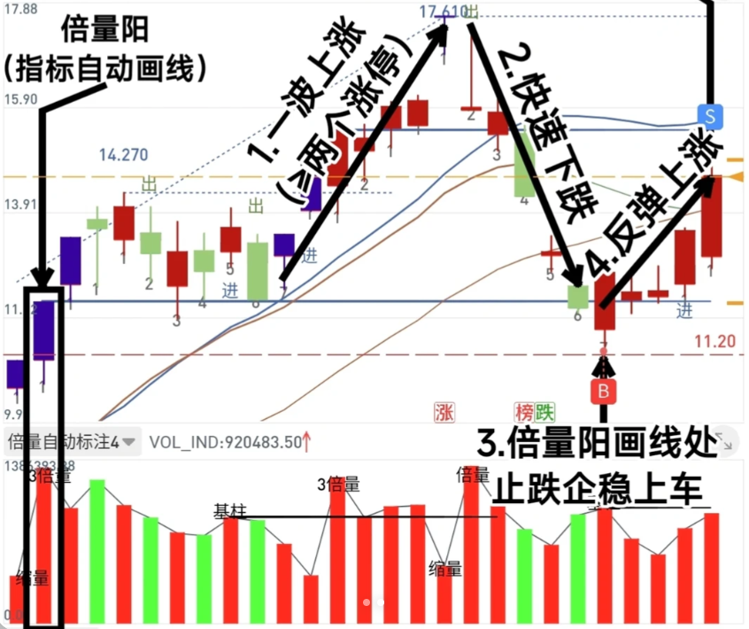

# A Share Analyzer

这个项目用于辅助每日 A 股选股：盘后生成 `watchlist`，盘中生成临时 `intraday watchlist`，再结合主线和人工判断整理到 `选股.md` / `选股-日中.md`。

注意：最终选股文字和表格会使用 ChatGPT 协助整理，只能作为候选参考，不是自动交易信号，也不能替代自己的买卖决策。

想看模型、回测、实现细节和历史方案，请看 [项目详细说明](docs/项目详细说明.md)。

## 快速查看

| 想看什么 | 入口 |
|---|---|
| 盘后人工整理选股 | [选股.md](选股.md) |
| 盘中人工整理选股 | [选股-日中.md](选股-日中.md) |
| 盘后候选池 | [reports/watchlists](reports/watchlists/) |
| 盘中候选池 | [reports/intraday_screening](reports/intraday_screening/) |
| 盘后完整信息     | [reports/patterns](reports/patterns/) |
| 主线记录 | [主线.md](主线.md) |

## 每日建议动作

### 盘中 12:00

```powershell
$DATE = "2026-05-11"
python -m stocks_analyzer --project-root . intraday-screening --date $DATE
```

然后调用大模型，根据 [intraday-picks-writing-guide.md](docs/intraday-picks-writing-guide.md) 更新 [选股-日中.md](选股-日中.md)。

### 盘中 14:40

```powershell
$DATE = "2026-05-11"
python -m stocks_analyzer --project-root . intraday-screening --date $DATE
```

如果已经刚更新过盘中行情，只想重算筛选：

```powershell
python -m stocks_analyzer --project-root . intraday-screening --date $DATE --skip-intraday-update
```

然后调用大模型，根据 [intraday-picks-writing-guide.md](docs/intraday-picks-writing-guide.md) 更新 [选股-日中.md](选股-日中.md)。

### 盘后

```powershell
$DATE = "2026-05-11"
python -m stocks_analyzer --project-root . daily-screening --date $DATE
```

然后调用大模型，根据 [picks-writing-guide.md](docs/picks-writing-guide.md) 更新 [选股.md](选股.md)。

如果有参考博主或外部观点，把材料放入 [reports/xueqiu](reports/xueqiu/) 或相应归档目录，再根据这些材料更新 [主线.md](主线.md)，最后再整理选股。

## 接口受限时怎么跑

盘中 `intraday-screening` 默认接口是新浪 `sina_raw`。如果需要临时改用东财：

```powershell
python -m stocks_analyzer --project-root . intraday-screening --date $DATE --data-interface eastmoney_direct
```

如果接口批量受限，可以降低批量大小：

```powershell
python -m stocks_analyzer --project-root . intraday-screening --date $DATE --chunk-size 10
```

如果今天已成功拉过盘中行情，不想再碰外部接口：

```powershell
python -m stocks_analyzer --project-root . intraday-screening --date $DATE --skip-intraday-update
```

盘后日线默认走 `sina`。如日线更新失败，可先单独换接口更新：

```powershell
python -m stocks_analyzer --project-root . update --start-date 20240101 --end-date 20260511 --data-interface eastmoney
python -m stocks_analyzer --project-root . update --start-date 20240101 --end-date 20260511 --data-interface baostock
```

## 核心指标怎么看

项目里所有展示用 `Phase*_score_100` 都按百分制归一化，**分数越高越值得买，分数越低风险越大或排序越差**。

| 指标 | 含义 | 怎么用 |
|---|---|---|
| Phase1 / P1 | 尾部下跌风险过滤。原始模型预测未来短期尾部风险，展示分越高表示风险越低 | P1 太低说明短期尾部风险高；非模式票通常不应太低 |
| Phase2 / P2 | Triple-barrier / CUSUM 风格交易风险。展示分越高表示交易型下行风险越低 | P2 太低说明容易先触发下行风险；模式票可放宽但要降仓 |
| Phase4 / P4 | Qlib Alpha158 + LightGBM 收益排序。展示分越高表示横截面收益排序越靠前 | 当前收益排序主轴；pattern 票自动入池要求 P4 > 70 |
| P4五日均 / std | 最近 5 个交易日的 P4 百分制均值和标准差 | 均值高说明收益排序持续靠前，std 低说明排序更稳定 |
| Phase5 / P5 | MCD 极端风险画像 | 只做极端风险提示，不做日常硬过滤 |
| Phase7 / P7 | 交易日闸门 | 仅提示当日是否适合开新仓；目前不作为核心依赖 |
| ATR14 / ATR% | 14 日平均真实波幅 | 用于止损距离和最大仓位计算 |

当前 watchlist 主要有两条入口：

1. `phase4_top`：P1/P2 不低，P4 高，再按 `P4 + P1/P2 接近 80 的加分` 排序。
2. `pattern`：命中模式后不再限制 P1/P2，只要求 P4 > 70；P1/P2 低时必须降低仓位和写清止损风险。

两条入口都会在最终入选前排除当日涨幅 `> 9.9%` 的股票，避免把已经涨停或接近涨停的标的放入盘后候选。整理 [选股.md](选股.md) 时，最终选股表展示 `P1/P2/P4`、`P4五日均/std`、Phase5、当日涨幅和连续上榜天数；建议总仓位、收盘价、ATR、止损止盈只放在交易辅助信息表。

`watchlist_YYYY-MM-DD.csv` 和盘中 `intraday_top20_YYYY-MM-DD.csv` 的前置列按人工查看顺序排列：交易日期、股票代码、名称、涨幅、来源、pattern 命中情况、P1/P2/P4、P4五日均/std、P5、ATR%、建议总仓位、技术指标、Phase 细节、pattern 细节。日常快速浏览优先看前 15-20 列即可。

## 六个 pattern 在识别什么

pattern 只是候选结构，不是独立买点。

| 模式 | 名称 | 识别重点 |
|---|---|---|
| 模式1 | 量顶天立地预突破 | 长时间消化老前高后，价格接近关键前高但还未有效突破 |
| 模式2 | 量顶天立地突破确认 | 放量突破老前高，关注突破位能否站稳 |
| 模式3 | 量顶天立地突破后缩量回踩 | 突破后回踩，要求缩量且不有效跌破关键承接位 |
| 模式4 | 老鸭头鸭鼻孔金叉 | 鸭头顶后缩量回调，回调低点后 MA5 再上穿 MA10 |
| 模式5 | 趋势回踩 | 上升趋势中回踩 MA20 或趋势支撑后尝试修复 |
| 模式6 | 倍量阳支撑线反抽 | 倍量阳形成支撑线，回落到支撑附近后缩量企稳反抽 |

**模式1-3**：量顶天立地，参考小红书：一种模式一万遍！



**模式4**



**模式6**：两倍量七转，参考小红书：一种模式一万遍！





## 推荐交易策略

### 仓位

单笔交易最大亏损按账户资金 `E` 的 `2%` 控制，单一标的总仓位上限 `40% E`。

设：

```text
P = 计划开仓价
ATR = ATR14
D = 2 * ATR
```

因为计划分批买入，第二批在回撤 `D/2` 附近买入，第三次加仓前止损仍在 `P - D`，前两批的有效平均止损距离按 `0.85D` 估计：

```text
理论总仓位比例 = 0.02 * P / (0.85 * D)
              = 0.02 * P / (0.85 * 2 * ATR)
              ≈ 0.01176 * P / ATR
```

最终仓位：

```text
建议总仓位 = min(40%, 理论总仓位比例)
```

watchlist 和日中 focus 中的“建议总仓位%”就是按这个口径生成，用来限制最大计划仓位，不代表必须一次买满。

### 分四批买入

| 批次 | 仓位 | 触发 |
|---|---:|---|
| 第 1 批 | 30% | 开仓点 P |
| 第 2 批 | 30% | 回踩结构线或回撤到约 `P - D/2` 后承接确认 |
| 第 3 批 | 20% | 上涨到 `+1R` 后回踩不破，再确认加仓 |
| 第 4 批 | 20% | 创新高且趋势延续 |

这里 `R = D = 2 * ATR14`。不要因为下跌而摊平；第二批必须是“结构线/回撤承接仍有效”，不是破位补仓。

### 止盈止损

| 阶段 | 动作 |
|---|---|
| 初始 | 止损放在 `P - R` |
| 价格上涨到 `+1R` | 止损上移到 `P` 附近，原则上不让盈利交易变成大亏 |
| 价格上涨到 `+1.5R` | 卖出 20%-30% |
| 价格上涨到 `+3R` | 再卖出 20%-30% |
| 后续趋势仓 | 用实时 `最高价 - 2.5 * ATR` 动态止损；跌破移动止损则清仓 |
| 时间止损 | 买入后 5 个交易日仍未站稳买入逻辑或未接近 `+0.5R`，停止加仓并减仓观察；10 个交易日仍未到 `+1R`，原则上退出；20 个交易日仍未进入趋势仓，清仓释放资金 |

根据当前回测，在“一次性买入、不做移动止损”的简化场景下，**固定持仓 60 日不动的平均收益最高**。但这个规则机械、回撤承受要求高；实盘仍建议按 ATR 仓位、分批买入和动态止损执行。

## 日常使用提醒

- `选股.md` 和 `选股-日中.md` 是人工/ChatGPT 整理后的阅读入口，不是模型原始输出。
- 买入前先看主线，再看 P1/P2/P4，再看 ATR 仓位和止损位置。
- 候选池优先用 `centered Top20`，再优先挑其中同时进入“五日 P4 均分 Top5”的股票；这类票兼顾当日风险位置和 Phase4 连续强度。
- 买入后必须执行时间止损：5 日不转强先降级，10 日未到 `+1R` 原则退出，20 日未进入趋势仓清仓。
- P1/P2 不是越高越好，历史结果显示接近 70-90，尤其接近 80 的风险状态更适合当前排序口径。
- pattern 票的 P1/P2 可以低，但低分意味着波动大、止损要更严格、仓位要更小。
- 不要追当日涨停或接近涨停的票，watchlist 会在入选前过滤涨幅 `> 9.9%` 的候选。
- 所有持仓理由、计划买入价、仓位、止损、第一次止盈位置，建议写入本地 `持仓.md`。
