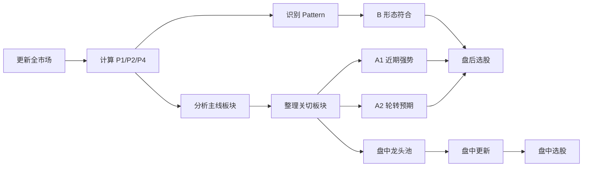

# A Share Analyzer

这个项目用于辅助每日 A 股选股。当前系统的核心是：**先判断市场主线，再从真正贴近主线的股票里选个股**。盘后生成 A1 近期强势、A2 轮转预期、B 形态符合三条独立路线；盘中只更新 A 池，不再维护手动跟踪表。

注意：最终选股文字会使用 ChatGPT 协助整理，只能作为候选参考，不是自动交易信号，也不能替代自己的买卖决策。

更完整的模型、回测和实现细节见 [项目详细说明](docs/项目详细说明.md)。

## 项目流程



## 快速入口

| 想看什么 | 入口 |
|---|---|
| 主线记录 | [主线.md](主线.md) |
| 盘后主线跟踪 | [reports/sectors/sector_mainline_daily_tracking.xlsx](reports/sectors/sector_mainline_daily_tracking.xlsx) |
| 盘后板块候选池 | [reports/watchlists/watchlist_sectors_YYYY-MM-DD.csv](reports/watchlists/) |
| 盘后 A1 近期强势 | [reports/watchlists/watchlist_a1_recent_mainline_YYYY-MM-DD.csv](reports/watchlists/) |
| 盘后 A2 轮转预期 | [reports/watchlists/watchlist_a2_rotation_expected_YYYY-MM-DD.csv](reports/watchlists/) |
| 盘后 B 形态符合 | [reports/watchlists/watchlist_b_pattern_YYYY-MM-DD.csv](reports/watchlists/) |
| 次日盘中源池 | [reports/watchlists/watchlist_sector_leader_pool_YYYY-MM-DD.csv](reports/watchlists/) |
| 盘中主线跟踪 | [reports/sectors/sector_mainline_intraday_tracking.xlsx](reports/sectors/sector_mainline_intraday_tracking.xlsx) |
| 盘中板块强度 | [reports/intraday_screening/intraday_sector_strength_YYYY-MM-DD.csv](reports/intraday_screening/) |
| 盘中 A1/A2 股票池 | [reports/intraday_screening/intraday_watchlist_a_YYYY-MM-DD.csv](reports/intraday_screening/) |
| **盘后选股** | [选股.md](选股.md) |
| **盘中选股** | [选股-日中.md](选股-日中.md) |
| 全市场 Pattern 结果 | [reports/patterns/patterns_all_YYYY-MM-DD.csv](reports/patterns/) |
| 单股参数工具 | [stock_parameter_tool.exe](stock_parameter_tool.exe) |

## 每日建议动作

盘中 10:00，更新前一日板块龙头池：

```powershell
$DATE = "2026-05-18"
python -m stocks_analyzer --project-root . intraday-screening --date $DATE
```

盘中 11:40，扫描全市场并生成当天新的板块龙头池：

```powershell
$DATE = "2026-05-18"
python -m stocks_analyzer --project-root . intraday-screening --date $DATE --refresh-full-market-pool
```

盘中 14:30，再按当天池更新一次：

```powershell
$DATE = "2026-05-18"
python -m stocks_analyzer --project-root . intraday-screening --date $DATE
```

盘后 17:30，完整复盘：

```powershell
$DATE = "2026-05-18"
python -m stocks_analyzer --project-root . daily-screening --date $DATE
```

运行后按 [picks-writing-guide.md](docs/picks-writing-guide.md) 更新 [选股.md](选股.md)，按 [intraday-picks-writing-guide.md](docs/intraday-picks-writing-guide.md) 更新 [选股-日中.md](选股-日中.md)。如果有参考博主或外部观点，先归档到 [reports/xueqiu](reports/xueqiu/) 并更新 [主线.md](主线.md)。

接口受限时可以跳过行情刷新，只重算筛选：

```powershell
python -m stocks_analyzer --project-root . intraday-screening --date $DATE --skip-intraday-update
```

盘中默认接口是新浪 `sina_raw`。若接口不稳定，可降低批量大小或临时切换东财：

```powershell
python -m stocks_analyzer --project-root . intraday-screening --date $DATE --chunk-size 10
python -m stocks_analyzer --project-root . intraday-screening --date $DATE --data-interface eastmoney_direct
```

盘后日线默认走 `sina`。如日线更新失败，可单独换接口：

```powershell
python -m stocks_analyzer --project-root . update --start-date 20240101 --end-date 20260518 --data-interface eastmoney
python -m stocks_analyzer --project-root . update --start-date 20240101 --end-date 20260518 --data-interface baostock
```

## 核心逻辑

每日先看主线，不先看个股分数。

1. **长期主线**：看 `sector_mainline_daily_tracking.xlsx` 和 `watchlist_sectors` 的长期主线指数，找长期受资金追捧、能反复炒作的方向。
2. **近期主线**：在长期主线 Top100 中，看短期主线指数，找近期带动市场的方向。
3. **轮转预期**：在长期主线 Top100 中，看 P9 买入分，找未来 20 个交易日仍有上涨概率的方向。
4. **关切板块**：用个股在板块中的龙头指数重建真实归属。`龙头指数 >= 60` 才算真实有关联；没有任何关切板块的股票标记为弱势股。
5. **路线选股**：A1、A2、B 三条路线分开看，不混排。

A1 是近期强势路线：长期主线 Top100 内的短期强度 Top20，从真实属于这些板块的股票里只做公共过滤 `涨幅<=9.9%、P1>20、P2>20`，先生成较宽的候选池。最终人工选股再优先看板块 P9、P1/P2/P4 混合分、龙头指数和涨幅是否过热。

A2 是轮转预期路线：长期主线 Top100 内的 P9 Top20，从真实属于这些板块的股票里筛到 `涨幅<=9.9%、P1>40、P2>40` 后停止。最终人工选股再优先看混合分、龙头指数、P4 强弱和是否适合低位分批建仓。

B 是形态符合路线：命中任一 Pattern，且通过公共硬过滤 `涨幅<=9.9%、P1>20、P2>20`。B 不和 A1/A2 混排，只作为结构候选。

所有路线都排除当日涨幅 `>9.9%` 的股票。若长期主线、短期主线和 P9 头部分数都不强，说明市场可能混沌，应减少新开仓。

## 当前指标

展示用分数统一为 0-100，越高越适合观察。

| 指标 | 含义 | 用法 |
|---|---|---|
| P1 | 尾部下跌风险过滤，越高表示短期尾部风险越低 | 低于 20 直接排除；A 路线要求高于 40 |
| P2 | Triple-barrier / CUSUM 交易型风险，越高表示先触发下行风险概率越低 | 低于 20 直接排除；A 路线要求高于 40 |
| P4 | Qlib Alpha158 + LightGBM 收益排序 | A 路线要求高于 60 |
| P4五日均 / std | 最近 5 个交易日 P4 均值和波动 | 均值高、std 低说明上涨排序更稳定 |
| P9 | 板块买入概率，预测板块等权指数第 20 个未来交易日收盘涨幅是否超过 5% | 用于 A1/A2 板块选择 |
| 长期主线指数 | 板块过去约两年的资金关注、趋势、超额和抗跌表现 | 判断长期可反复跟踪的方向 |
| 短期主线指数 | 板块最近 5-20 日涨幅、当日涨幅、上涨家数和短期斜率 | 判断是否正在带动市场 |
| 龙头指数 | 个股在所属板块中的长期领涨和波段领涨能力 | 关切板块阈值 60；A1/A2 生成候选池时不硬过滤，由复盘时人工优先选择高龙头指数 |
| ATR14 / ATR% | 14 日平均真实波幅 | 用于止损距离和最大仓位 |

P3、P5、P7、P8、P10 已废弃。新盘后/盘中流程不再调用、不展示，也不作为选股依据。

## 盘后流程

`daily-screening` 当前执行：

1. 更新全市场日线。
2. 更新行业/概念映射；缓存未超过 7 天时不重抓映射，只重算当日板块表现。
3. 计算 MACD、ATR。
4. 对全市场计算 P1、P2、P4。
5. 对全市场匹配六个 Pattern，只生成 `patterns_all_YYYY-MM-DD.csv`。
6. 计算所有行业/概念的龙头指数。
7. 根据 `combined_leader_score >= 60` 生成 `stock_concern_sectors` 和 `concern_sector_members`。
8. 计算行业/概念 P9；没有模型则 P9 留空并提示需要先训练。
9. 生成 `watchlist_sectors_YYYY-MM-DD.json/csv`，并更新 `sector_mainline_daily_tracking.xlsx`。
10. 生成 A1/A2/B 三条路线 watchlist。
11. 生成 `watchlist_sector_leader_pool_YYYY-MM-DD.json/csv`，作为次日普通盘中模式源池。
12. 清理 `reports/sectors` 中无最终用途的过程文件。

## 盘中流程

普通模式默认读取上一交易日的 `watchlist_sector_leader_pool`。如果当天跑过 `--refresh-full-market-pool`，则优先读取当天新生成的池。

盘中只处理 A 池，不处理 B 池。系统用池内每个板块 5 支龙头股的盘中涨幅均值反推当日板块强度，生成 `intraday_sector_strength_YYYY-MM-DD.csv`，再输出日中 A1/A2 股票池。

## 六个 Pattern

Pattern 只是候选结构，不是独立买点。

| 模式 | 名称 | 识别重点 |
|---|---|---|
| 模式1 | 量顶天立地预突破 | 长时间消化老前高后，价格接近关键前高但还未有效突破 |
| 模式2 | 量顶天立地突破确认 | 放量突破老前高，关注突破位能否站稳 |
| 模式3 | 量顶天立地突破后缩量回踩 | 突破后回踩，要求缩量且不有效跌破关键承接位 |
| 模式4 | 老鸭头鸭鼻孔金叉 | 鸭头顶后缩量回调，回调低点后 MA5 再上穿 MA10 |
| 模式5 | 趋势回踩 | 上升趋势中回踩 MA20 或趋势支撑后尝试修复 |
| 模式6 | 倍量阳支撑线反抽 | 倍量阳形成支撑线，回落到支撑附近后缩量企稳反抽 |

## 交易纪律

单笔交易最大亏损按账户资金 `E` 的 `2%` 控制，单一标的总仓位上限 `40% E`。

```text
P = 计划开仓价
ATR = ATR14
D = 2 * ATR
理论总仓位比例 = 0.02 * P / (0.85 * D)
              = 0.02 * P / (0.85 * 2 * ATR)
              ≈ 0.01176 * P / ATR
建议总仓位 = min(40%, 理论总仓位比例)
```

四批买入：第一批 30% 在开仓点，第二批 30% 在回踩结构线或回撤约 `D/2` 后确认，第三批 20% 在上涨到 `1R` 后回踩不破，第四批 20% 在创新高且趋势延续。

止损止盈：初始止损 `P-D`；上涨到 `1R` 后止损上移到 `P`；`1.5R` 卖出 20%-30%；`3R` 再卖出 20%-30%；剩余仓位按最高点 `- 2.5 * 实时 ATR` 动态止损。跌破移动止损清仓，不临时下移止损。买入后 5 个交易日仍不能脱离成本区或站稳结构位，主动降仓或退出。

回测显示，一次性买入情况下，固定持有 60 日的平均收益最高。但实际交易不宜机械死扛，因此执行上采用 ATR 仓位、分批买入、分批止盈和动态止损。
