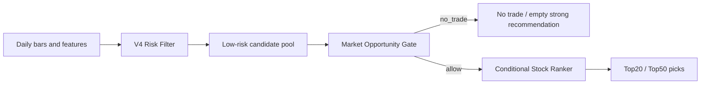

# V4.2 Opportunity-Gated Ranker Design

## Context

V4 and V4.1 showed the same split result:

- The V4 risk filter is useful. Validation/test risk AUC is about 0.706/0.704, and the hard gate materially lowers bad-risk rate and stop-loss rate.
- The low-risk-pool return ranker is still weak. V4.1 replaced the pointwise long-upside regressor with a `long_quality` LambdaRank model, but test candidate-pool Spearman dropped to about -0.009 and Top20 outcomes were worse than V4.

The current failure is therefore not mainly a risk problem. It is a conditional opportunity problem: many dates may not contain enough exploitable long-side opportunity inside the low-risk pool. Forcing a Top20 every day makes the stock ranker learn from noisy or structurally bad days.

## Goal

V4.2 should answer two questions in order:

1. Is today worth trading after the V4 risk gate?
2. If yes, which low-risk stocks should rank highest?

The target priorities are:

- Improve Top20/Top50 average 20-day return.
- Improve buy-day win rate, while allowing fewer trading days.
- Balance return and risk, including the ability to output no-trade days.

## Non-Goals

- Do not rebuild the V4 risk filter.
- Do not optimize for always-on daily recommendations.
- Do not judge success only by all-sample correlation.
- Do not replace the daily screening pipeline in this step; first produce V4.2 training, prediction, and comparison reports.

## Architecture



V4.2 keeps the V4 risk filter as the hard first stage. The new pieces are:

- `Opportunity Gate`: a date-level model that predicts whether a risk-passed candidate pool has enough future return quality.
- `Conditional Stock Ranker`: a stock-level ranker trained only on dates that historically had acceptable opportunity.

## Risk Layer

The risk layer reuses the V4 setup:

- Stage1 models for M5/M10/M20/M60.
- Stage2 risk model using stage1 outputs and derived features.
- Hard gate using risk percentile, risk score cap, 20/60 down-probability caps, and weighted down-probability cap.

The selected gate starts from the V4.1 successful risk parameters:

```text
risk_percentile = 0.30
risk_score_max = 0.36
down20_max = 0.32
down60_max = 0.24
weighted_down_max = 0.30
```

These can still be selected by validation search, but V4.2 should report risk metrics separately from opportunity and ranking metrics.

## Opportunity-Day Label

For each trade date, first apply the V4 risk gate and score the low-risk candidate pool with the baseline V4 long-upside score. Build daily outcome summaries for Top20 and Top50.

Training labels must use out-of-fold baseline scores for the training split and strictly earlier-trained scores for validation/test. The date-level label may use future returns because it is the supervised target, but the candidate pool and TopN set used to summarize that target must be selected only from scores that would have been known at that date.

Define a date as `good_opportunity_day = 1` when the daily candidate opportunity is strong enough:

```text
primary:
  top20_avg_return_20d > 0
  top20_win_rate_20d >= 0.35
  top20_stop_loss_rate_20d <= 0.08

supporting:
  top50_avg_return_20d > -0.005
  top50_stop_loss_rate_20d <= 0.10
  candidate_count >= 20
```

The final label can be a binary label plus a continuous quality score:

```text
opportunity_quality =
  1.00 * top20_avg_return_20d
+ 0.45 * top20_win_rate_20d
+ 0.25 * top20_take_profit_rate_20d
- 0.85 * top20_stop_loss_rate_20d
- 0.70 * top20_avg_max_drawdown_20d
+ 0.30 * top50_avg_return_20d
- 0.35 * top50_stop_loss_rate_20d
```

The binary label is for gating; the continuous score is for diagnostics and threshold selection.

## Opportunity-Gate Features

The gate must use only information known on the trade date. It should aggregate the risk-passed candidate pool into date-level features:

- Candidate count and fraction of the universe passing risk.
- Mean, median, p10, p25, p75, and p90 of `risk_score`.
- Mean and low-tail distribution of `down_prob_20d`, `down_prob_60d`, and weighted down probability.
- Mean and top quantiles of V4 long-upside score.
- Cross-sectional dispersion of long-upside score: standard deviation, top-minus-median, p90-minus-p10.
- Breadth features: share above MA20/MA60, share with positive 20/60-day return, share with positive MACD histogram if available.
- Market proxy features computed from the full universe: average 20/60-day return, drawdown, volatility, and up-day breadth.

The initial model should be a calibrated classifier:

```text
HistGradientBoostingClassifier or LogisticRegression fallback
target = good_opportunity_day
output = opportunity_score
```

Threshold selection should happen on validation data and optimize the final trading objective, not classifier accuracy.

## Conditional Stock Ranker

The stock ranker trains only on dates that are historical `good_opportunity_day = 1` in the training split. Its input rows are the V4 risk-passed candidate stocks for those dates.

The first version should reuse the better baseline among V4 and V4.1:

- Start with V4 long-upside-style features and V4.1 cross-sectional rank features.
- Train a stock-level ranker only on good opportunity days.
- Use the same `long_quality` label as V4.1, but do not train on no-opportunity dates.

Primary model:

```text
LGBMRanker(objective="lambdarank", metric="ndcg", group=trade_date)
label = long_quality_grade
```

Fallback:

```text
HistGradientBoostingRegressor
target = daily long_quality rank percentile
```

## Prediction Flow

For a prediction date:

1. Build the current feature frame.
2. Apply the V4 risk filter and hard risk gate.
3. Aggregate the risk-passed pool into date-level opportunity features.
4. Compute `opportunity_score`.
5. If `opportunity_score < selected_threshold`, return a no-trade report with the low-risk pool retained for diagnostics.
6. If allowed, score candidates with the conditional stock ranker and output Top20/Top50.

The prediction report should include:

- `trade_permission`: `allow` or `no_trade`.
- `opportunity_score`.
- `opportunity_threshold`.
- Candidate-pool diagnostics.
- Stock rankings when allowed.

## Evaluation

V4.2 must be evaluated against V4 and V4.1 on the same splits.

Risk metrics:

- Risk AUC.
- Candidate bad-risk rate.
- Candidate stop-loss rate and drawdown.

Opportunity-gate metrics:

- Coverage days: allowed days / all evaluable days.
- Good-day precision and recall.
- Average candidate-pool outcome on allowed vs blocked days.

Final TopN metrics on allowed days:

- Top20/Top50 average 20-day return.
- Top20/Top50 win rate.
- Top20/Top50 take-profit rate.
- Top20/Top50 stop-loss rate.
- Top20/Top50 average max drawdown.
- Bad-risk rate.

Report both conditional metrics and calendar-level metrics:

- Conditional metrics: only on allowed trading days.
- Calendar-level metrics: all days, with no-trade days counted as no position.

## Success Criteria

Use V4 test Top20 as the baseline:

```text
avg_return_20d = 0.779%
win_rate = 26.88%
stop_loss_rate_20d = 5.16%
```

V4.2 is considered useful if test Top20 satisfies:

```text
avg_return_20d > 0.779%
win_rate > 26.88%
stop_loss_rate_20d <= 7.0%
coverage_days >= 30%
```

If V4.2 improves return and win rate but coverage is below 30%, it should be reported as an aggressive timing filter rather than a main-version replacement.

## Testing

Add focused tests for:

- Date-level opportunity-label construction.
- Opportunity feature aggregation using only current-date features.
- Threshold selection based on validation TopN outcomes.
- No-trade prediction path.
- Allow prediction path with ranked candidates.
- CLI parser and smoke training workflow.

The implementation should keep V4, V4.1, and V4.2 reports side by side so regressions are visible.
