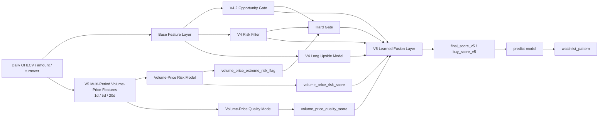

# V5 Volume-Price Fusion Model Design

## Status

Approved design. No implementation has been started from this spec yet.

## Goal

Build V5 on top of the current V4.2 hybrid daily model by adding explicit multi-period volume-price judgment.

The current production direction is `v42_gate_v4_rank`: V4.2 opportunity gate decides whether the day is tradable, and V4 `long_upside_score` ranks the low-risk pool. V5 keeps that useful structure and adds a daily-bar volume-price subsystem so the model can better judge whether the remaining stocks are worth buying.

The main goal is not to predict short-term noise. The goal is to improve the ranking quality of already risk-filtered stocks by learning whether the 20-day volume-price structure is healthy and whether the recent 5-day structure confirms a usable buy point.

## Decisions

| Decision | Choice |
|---|---|
| Model direction | Add volume-price submodels plus a learned fusion layer |
| Primary improvement target | Return ranking after existing risk/opportunity gates |
| Risk-side volume-price target | Detect volume-price risk and extreme risk exclusion |
| Return-side volume-price target | Learn healthy upside path quality |
| Data source | Daily bars only |
| Time scales | 20-day main judgment, 5-day buy-point confirmation, 1-day trigger/risk hints |
| Daily integration name | Keep using `predict-model` |
| Report path | Keep generic `reports/predict_model/predictions_YYYY-MM-DD.csv` |

## Non-Goals

- Do not introduce 5-minute bars into V5. Intraday confirmation remains the job of `intraday-screening`.
- Do not replace the V4.2 opportunity gate in the first V5 iteration.
- Do not rely on TradingView aggregate scores as primary ranking signals.
- Do not create a separate daily screening command. V5 should remain behind the generic `predict-model` layer.
- Do not optimize only for higher average return if stop-loss and bad-risk metrics deteriorate materially.

## Current Baseline

V4.2 hybrid has the best current test result among the recent model variants:

- It uses V4.2 opportunity gate for no-trade days.
- It uses V4 `long_upside_score` for stock ranking.
- It improved Top20 / Top50 average 20-day return and take-profit rate versus the V4 all-day baseline.
- Its main weakness is still stock selection within the remaining candidate pool.
- Its Top20 bad-risk rate is slightly worse than V4 baseline, so V5 must not pursue return at the cost of uncontrolled risk.

## Architecture



## Feature Design

V5 uses daily bars, but it does not only look at the latest daily candle. It builds multi-period volume-price structure from 1-day, 5-day, and 20-day windows.

### 1-Day Features

1-day features describe the latest candle as a trigger or risk hint:

- close position inside the daily range
- body size and candle direction
- upper shadow and lower shadow ratios
- volume ratio versus 5-day and 20-day averages
- amount ratio versus 5-day and 20-day averages
- turnover state if turnover is available
- high-volume upper-shadow flag
- high-volume bearish candle flag
- high-volume failed breakout hint
- low-volume stabilization hint

These features should not dominate the long-term target. They mainly help detect obvious distribution or confirm the latest buy point.

### 5-Day Features

5-day features describe short-term buy-point confirmation:

- 5-day return
- 5-day volume and amount change
- price up with volume expansion
- price up without volume confirmation
- price down with volume contraction
- price down with volume expansion
- 5-day close position relative to the 5-day high/low range
- count of high-volume up days
- count of high-volume down days
- 5-day upper-shadow pressure
- 5-day lower-shadow support
- 5-day volume concentration ratio

Interpretation:

- Positive: shrinkage pullback, volume-backed rebound, stable close near upper range after moderate volume.
- Negative: volume expansion without price progress, repeated upper shadows, expanding volume while closing weak.

### 20-Day Features

20-day features are the main V5 volume-price judgment layer:

- 20-day return
- 20-day volume and amount trend
- 20-day range position
- 20-day high-volume day distribution
- price progress per unit volume
- amount progress per unit return
- platform shrinkage ratio
- breakout-volume confirmation
- high-position volume expansion without price progress
- 20-day up-volume versus down-volume balance
- 20-day accumulation-style score
- 20-day distribution-style score

Interpretation:

- Positive: healthy 20-day price progress with moderate volume expansion, shrinkage consolidation near MA20, and volume confirmation near breakout.
- Negative: high-position volume expansion with little price progress, repeated high-volume weak candles, or price deterioration with increasing volume.

### 5-Day versus 20-Day Features

Cross-window features compare short-term behavior against the medium window:

- 5-day return minus 20-day normalized return
- 5-day volume ratio versus 20-day volume ratio
- 5-day amount ratio versus 20-day amount ratio
- short-term volume acceleration
- short-term price acceleration
- volume acceleration without price acceleration
- short-term shrinkage after 20-day price strength
- 5-day pullback depth inside 20-day trend

Interpretation:

- Positive: 20-day structure is healthy, and 5-day behavior shows controlled pullback or renewed confirmation.
- Negative: 5-day volume is suddenly high while price does not improve, especially near 20-day highs.

## Volume-Price Risk Model

The risk side learns volume-price risk exclusion.

### Outputs

- `volume_price_extreme_risk_flag`
- `volume_price_risk_score`

### Extreme Risk Flag

The extreme risk flag is rule-based and should be conservative. It is intended for cases where the signal is obvious enough to block a stock before fusion ranking.

Candidate hard-risk patterns:

- high-position high-volume long upper shadow
- high-position high-volume bearish candle
- high-volume breakdown below short or medium moving averages
- clear volume-price bearish divergence
- repeated 5-day high-volume weak closes
- high-volume failed breakout followed by weak close

The flag should be sparse. It should not block normal volume expansion on real breakouts or healthy high-turnover replacement.

### Risk Score Label

`volume_price_risk_score` learns a future adverse-path label using only current and historical volume-price features.

The label should be positive when the next 20 trading days show one or more of:

- stop-loss style drawdown
- bad-risk outcome already used by the V4 risk framework
- high drawdown before meaningful upside
- weak forward return with elevated drawdown

The score is a soft risk signal. It enters the V5 fusion layer and can also be reported for interpretability.

## Volume-Price Quality Model

The return side learns healthy upside path quality.

### Output

- `volume_price_quality_score`

### Quality Target

The target should reward healthy forward paths, not raw upside alone. A good sample should have:

- positive 20-day return
- tolerable 20-day maximum drawdown
- low stop-loss frequency
- reasonable 60-day confirmation when available
- better return-to-drawdown shape
- no severe adverse move before the upside happens

The 20-day window is the main quality objective. The 60-day outcome may be used as confirmation, but the label should not turn into a pure 60-day target.

The 5-day features are used as buy-point confirmation inputs, not as the primary target.

## Fusion Layer

V5 uses a learned fusion layer instead of a fixed weighted formula.

### Fusion Inputs

Required model-level inputs:

- `opportunity_score`
- `risk_score`
- `long_upside_score`
- `volume_price_extreme_risk_flag`
- `volume_price_risk_score`
- `volume_price_quality_score`

Recommended summary feature inputs:

- key 1-day risk/trigger fields
- key 5-day buy-point confirmation fields
- key 20-day volume-price health fields
- 5-day versus 20-day acceleration/divergence fields
- existing cross-sectional rank fields where useful

### Fusion Output

- `final_score_v5`
- `buy_score_v5`
- `model_version = v5_volume_price_fusion`

### Hard Gate Order

1. If the opportunity gate says no trade, output no-trade.
2. If the V4 risk gate rejects the stock, filter it out.
3. If `volume_price_extreme_risk_flag` is true, filter it out.
4. Rank the remaining stocks with the V5 fusion score.

## Training Plan

V5 must avoid leakage in the same way as V4.2:

1. Build the base daily dataset from local OHLCV history.
2. Add V4/V4.2 stage outputs with walk-forward or out-of-fold predictions.
3. Add V5 volume-price features using only rows up to the signal date.
4. Train the volume-price risk model and produce OOF `volume_price_risk_score`.
5. Train the volume-price quality model and produce OOF `volume_price_quality_score`.
6. Train the V5 fusion model on OOF model scores and current-date features.
7. Retrain deployment artifacts on the full training window after validation selection.

The fusion layer must never train on in-sample submodel predictions. It should consume OOF scores for training and deployment scores for prediction.

## Evaluation

V5 is compared primarily against the current V4.2 hybrid `v42_gate_v4_rank`.

Primary test metrics:

- Top20 average 20-day return
- Top20 win rate
- Top20 take-profit rate
- Top20 stop-loss rate
- Top20 bad-risk rate
- coverage days

V5 succeeds only if:

- Top20 average 20-day return improves versus V4.2 hybrid.
- Top20 win rate or take-profit rate improves versus V4.2 hybrid.
- stop-loss rate and bad-risk rate do not materially worsen versus V4.2 hybrid.
- coverage remains practically useful.

Secondary diagnostics:

- Top50 metrics
- volume-price risk model AUC / precision / recall where applicable
- volume-price quality score rank correlation with healthy-path value
- average `volume_price_quality_score` in selected versus rejected candidates
- reason counts for extreme risk filtering

## Reports and Artifacts

Suggested artifact paths:

- `data/ml/v5_volume_price_fusion/v5_volume_price_fusion.pkl`
- `data/ml/v5_volume_price_fusion/v5_volume_price_fusion_metadata.json`

Suggested report paths:

- `reports/v5_volume_price_fusion/v5_topn_metrics.csv`
- `reports/v5_volume_price_fusion/v5_comparison.csv`
- `reports/v5_volume_price_fusion/v5_volume_price_risk_metrics.csv`
- `reports/v5_volume_price_fusion/v5_volume_price_quality_metrics.csv`
- `reports/v5_volume_price_fusion/predictions_YYYY-MM-DD.csv`

Daily integration output remains:

- `reports/predict_model/predictions_YYYY-MM-DD.csv`

## Prediction Output Fields

The generic `predict-model` CSV should include at least:

- `model_version`
- `symbol`
- `trade_date`
- `action`
- `trade_permission`
- `risk_tier`
- `risk_gate_reason`
- `risk_score`
- `long_upside_score`
- `opportunity_score`
- `opportunity_threshold`
- `volume_price_extreme_risk_flag`
- `volume_price_risk_score`
- `volume_price_quality_score`
- `final_score_v5`
- `buy_score_v5`
- key 1-day / 5-day / 20-day volume-price explanation fields

For compatibility during migration, the prediction file may also include `final_score_v42` and `buy_score_v42`, but watchlist should use V5 fields once V5 is promoted.

## Watchlist Integration

`watchlist_pattern` should treat V5 as the active model after promotion:

- require `trade_permission = allow`
- require `action = candidate`
- require no V5 extreme volume-price risk flag
- sort by `final_score_v5`, then `buy_score_v5`, then pattern priority

The daily workflow stays unchanged:

```text
daily-screening -> update -> tradingview -> predict-model -> macd -> atr -> trend-universe -> trend -> pattern -> watchlist
```

## Testing Plan

Focused tests should cover:

- volume-price feature generation for 1-day, 5-day, 20-day, and 5-vs-20 fields
- no future leakage in volume-price features
- extreme risk flag behavior for obvious distribution patterns
- risk-score and quality-score OOF training outputs
- V5 fusion score generation
- prediction report fields
- CLI parser for V5 train/predict commands if new commands are added
- `predict-model` output and watchlist integration after promotion

## Open Implementation Notes

- Start by implementing volume-price feature generation as a small, testable unit before changing model training.
- Keep V4.2 hybrid comparison in the training report so V5 can be rejected if it does not improve.
- Keep volume-price submodel metrics separate from final fusion metrics.
- Prefer conservative hard filters. Most ambiguous volume-price signals should remain soft scores.
