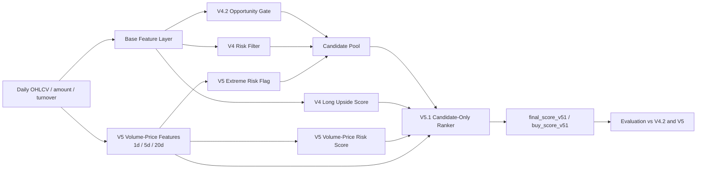

# V5.1 Candidate-Only Ranker Design

## Status

Approved direction. This spec defines the next V5 improvement before implementation.

## Goal

Improve V5 where it is currently weak: ranking the stocks that remain after the opportunity gate and risk filters.

The current V5 volume-price model added useful risk-side information, but the return-side `volume_price_quality_score` did not rank candidate stocks reliably. Validation candidate-pool rank correlation was weak, and test improvement was not stable enough to promote V5 into `predict-model`.

V5.1 therefore changes the learning problem. Instead of training a broad all-market volume-price quality regressor, it trains a ranker only on the post-filter candidate pool. The target directly matches the trading question:

> On days when the system is allowed to trade, among stocks that pass the existing risk gate, which names deserve the top slots?

## Current Baseline

The production baseline remains `v42_gate_v4_rank`:

- V4.2 opportunity gate decides whether the day is tradable.
- V4 risk filter controls the candidate pool.
- V4 `long_upside_score` ranks the remaining stocks.

V5 added volume-price features and a fusion score. It improved latest test Top20 slightly, but validation Top20 did not improve:

| Split | Model | Avg 20d Return | Win Rate | TP20 | SL20 | Bad Risk |
|---|---|---:|---:|---:|---:|---:|
| valid | V4.2 hybrid | 0.1077 | 0.8627 | 0.4443 | 0.0076 | 0.0437 |
| valid | V5 | 0.1047 | 0.8563 | 0.4342 | 0.0120 | 0.0449 |
| test | V4.2 hybrid | 0.1193 | 0.8000 | 0.4786 | 0.0286 | 0.1182 |
| test | V5 | 0.1247 | 0.8048 | 0.4976 | 0.0238 | 0.1068 |

The conclusion is that V5 has useful signals, but the current quality objective is not aligned tightly enough with the final ranking task.

## Architecture



## Model Scope

V5.1 is a ranking layer, not a replacement for the whole pipeline.

It keeps:

- V4.2 opportunity gate.
- V4 risk filter.
- V5 volume-price features.
- V5 extreme volume-price hard risk flag.

It changes:

- The return-side model trains only on candidate rows.
- The objective becomes daily cross-sectional ranking quality.
- The final score is evaluated only on tradable candidate days.

It does not:

- Replace `predict-model` until validation and test results both improve.
- Add intraday data.
- Use TradingView aggregate scores.
- Loosen the existing risk gate to chase return.

## Candidate Pool Definition

A row is eligible for V5.1 ranker training and scoring when:

- `trade_permission = allow`
- V4 risk gate action is `candidate`
- V5 `volume_price_extreme_risk_flag` is false
- forward labels required for evaluation are available

Rows blocked by opportunity or risk gates remain useful for diagnostics but do not train the candidate ranker.

## Label Design

V5.1 uses a candidate-pool daily ranking label rather than an all-market continuous target.

For each trade date, eligible candidate rows receive a `v51_rank_value` based on:

- 20-day realized return.
- 20-day take-profit outcome.
- 20-day stop-loss outcome.
- 20-day maximum drawdown.
- 60-day return confirmation when available.
- `bad_risk` penalty.

The default value formula:

```text
v51_rank_value =
  0.45 * clipped(period_return_20d / 0.15)
+ 0.20 * take_profit_20d
- 0.30 * stop_loss_20d
- 0.25 * clipped(max_drawdown_20d / 0.08)
+ 0.15 * clipped(period_return_60d / 0.30)
- 0.35 * bad_risk
```

Then each trading day converts `v51_rank_value` into:

- `v51_rank_pct`: daily percentile rank.
- `v51_rank_grade`: ordinal grade for ranking losses.

The grade uses daily percentiles:

- 4: top 10%
- 3: 75% to 90%
- 2: middle 35% to 75%
- 1: 15% to 35%
- 0: bottom 15%

This turns the target into “which stocks should be above others on the same day,” which is closer to watchlist construction than raw return regression.

## Model Choice

Primary model:

- Use LightGBM LambdaRank if `lightgbm` is available and there are enough rows and daily groups.

Fallback:

- Use `HistGradientBoostingRegressor` on `v51_rank_pct` with higher weights for grade 0 and grade 4.

This follows the existing V4.1/V4.2 ranker pattern and keeps the dependency optional.

## Feature Set

V5.1 uses a compact feature set from existing outputs:

Base model signals:

- `long_upside_score`
- `risk_score`
- `opportunity_score`
- `down_prob_20d`
- `down_prob_60d`
- `stage2_weighted_down_prob`

V5 volume-price signals:

- `volume_price_risk_score`
- `volume_price_quality_score`
- `volume_price_risk_score_pct`
- `volume_price_quality_score_pct`
- key 1-day candle/volume risk fields
- key 5-day confirmation fields
- key 20-day accumulation/distribution fields
- 5-day versus 20-day acceleration/divergence fields

Cross-sectional ranks:

- Daily percentile ranks for selected base and V5 signals.

The first implementation should avoid adding new raw features unless evaluation shows a clear gap.

## Score Fusion

V5.1 produces:

- `candidate_rank_score_v51`
- `candidate_rank_score_pct_v51`
- `final_score_v51`
- `buy_score_v51`

The default `final_score_v51` is the ranker output. A validation-selected blend may also be evaluated:

```text
final_score_v51_blend =
  w * candidate_rank_score_v51
+ (1 - w) * final_score_v42
```

Candidate weights to test: `0.50`, `0.65`, `0.80`, `1.00`.

Promotion should require the selected blend to beat V4.2 on validation and not regress on test.

## Training Plan

1. Build the same local daily dataset as V5.
2. Generate V4.2 hybrid base outputs.
3. Add V5 volume-price features and risk scores.
4. Apply the existing hard gates to form the V5.1 candidate pool.
5. Build daily candidate ranking labels.
6. Train the V5.1 ranker on training candidate rows.
7. Score validation and test candidate rows.
8. Select optional blend weight on validation.
9. Save artifact and reports only if the workflow completes.

The preferred strict path uses retrained base OOF predictions. Because that path was slow during V5 testing, the implementation may keep `--reuse-base-artifact` as a fast evaluation mode, but reports must record which mode was used.

## Evaluation

Primary comparison:

- V4.2 hybrid
- V5 volume-price fusion
- V5.1 candidate-only ranker
- V5.1 blended ranker if selected

Primary metrics:

- Top20 average 20-day return.
- Top20 win rate.
- Top20 take-profit rate.
- Top20 stop-loss rate.
- Top20 bad-risk rate.
- Top50 metrics as stability check.
- Daily candidate coverage.

Ranker diagnostics:

- Candidate-pool Spearman correlation.
- NDCG@20.
- Average label value of selected Top20 versus candidate pool.

Promotion criteria:

- Validation Top20 improves on V4.2 in at least one of average return, win rate, or take-profit rate.
- Validation Top20 stop-loss rate and bad-risk rate do not materially worsen.
- Test Top20 does not contradict the validation improvement.
- Top50 does not show a broad ranking deterioration.

## Reports and Artifacts

Suggested artifact:

- `data/ml/v51_candidate_ranker/v51_candidate_ranker.pkl`
- `data/ml/v51_candidate_ranker/v51_candidate_ranker_metadata.json`

Suggested reports:

- `reports/v51_candidate_ranker/v51_topn_metrics.csv`
- `reports/v51_candidate_ranker/v51_ranker_metrics.csv`
- `reports/v51_candidate_ranker/v51_comparison.csv`
- `reports/v51_candidate_ranker/predictions_YYYY-MM-DD.csv`

The generic `predict-model` output remains unchanged until V5.1 passes promotion criteria.

## Testing Plan

Add focused tests for:

- Candidate-pool label creation.
- Daily rank percentiles and ordinal grades.
- Ranker feature selection.
- Ranker scoring fields.
- Blend score selection.
- CLI parser for training and prediction commands if separate commands are added.

Run existing `test_stacked_trade_value.py` and CLI parser tests after implementation.

## Decision

Proceed with V5.1 as a candidate-only ranker. Keep V4.2 hybrid as the daily production model until V5.1 proves better on validation and test.
